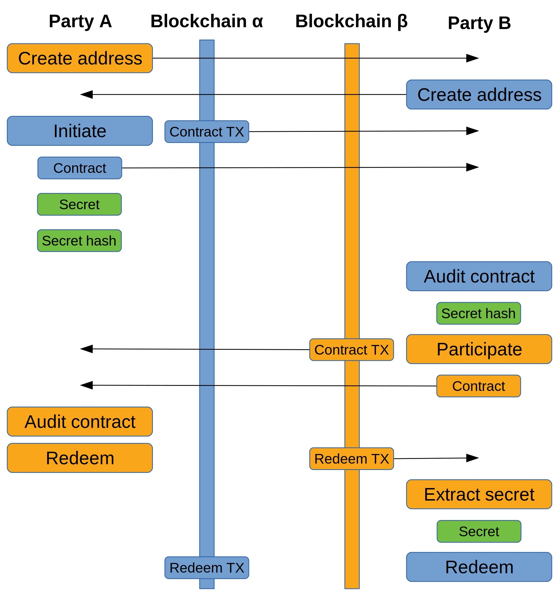

# BTC-Dash cross-chain atomic swapping

This repo contains utilities to manually perform cross-chain atomic swaps
between Dash and BTC.  At the moment, support exists for
the following coins and wallets:

* Bitcoin ([Bitcoin Core](https://github.com/bitcoin/bitcoin))
* Dash ([Dash Core](https://github.com/dashpay/dash))

## Build instructions

Pre-requirements:

  - Go 1.9 or later
  - [dep](https://github.com/golang/dep)
  - `dashcore` 0.5.7 or later (for `dshatomicswap`)

```
$ cd $GOPATH/src/github.com/
$ git clone https://github.com/atticlab/atomicswap && cd atomicswap
$ dep ensure
$ go install ./cmd/...
```

## Theory

A cross-chain swap is a trade between two users of different cryptocurrencies.
For example, one party may send Dash to a second party's Dash address, while
the second party would send Bitcoin to the first party's Bitcoin address.
However, as the blockchains are unrelated and transactions can not be reversed,
this provides no protection against one of the parties never honoring their end
of the trade.  One common solution to this problem is to introduce a
mutually-trusted third party for escrow.  An atomic cross-chain swap solves this
problem without the need for a third party.

Atomic swaps involve each party paying into a contract transaction, one contract
for each blockchain.  The contracts contain an output that is spendable by
either party, but the rules required for redemption are different for each party
involved.

One party (called counterparty 1 or the initiator) generates a secret and pays
the intended trade amount into a contract transaction.  The contract output can
be redeemed by the second party (called countryparty 2 or the participant) as
long as the secret is known.  If a period of time (typically 48 hours) expires
after the contract transaction has been mined but has not been redeemed by the
participant, the contract output can be refunded back to the initiator's wallet.

For simplicity, we assume the initiator wishes to trade Bitcoin for Dash with
the participant.  The initiator can also trade Dash for Bitcoin and the steps
will be the same, but with each step performed on the other blockchain.

The participant is unable to spend from the initiator's Bitcoin contract at this
point because the secret is unknown by them.  If the initiator revealed their
secret at this point, the participant could spend from the contract without ever
honoring their end of the trade.

The participant creates a similar contract transaction to the initiator's but on
the Dash blockchain and pays the intended Dash amount into the contract.
However, for the initiator to redeem the output, their own secret must be
revealed.  For the participant to create their contract, the initiator must
reveal not the secret, but a cryptographic hash of the secret to the
participant.  The participant's contract can also be refunded by the
participant, but only after half the period of time that the initiator is
required to wait before their contract can be refunded (typically 24 hours).

With each side paying into a contract on each blockchain, and each party unable
to perform their refund until the allotted time expires, the initiator redeems
the participant's Dash contract, thereby revealing the secret to the
participant.  The secret is then extracted from the initiator's redeeming Dash
transaction providing the participant with the ability to redeem the initiator's
Bitcoin contract.

This procedure is atomic (with timeout) as it gives each party at least 24 hours
to redeem their coins on the other blockchain before a refund can be performed.

The image below provides a visual of the steps each party performs and the
transfer of data between each party.



## Command line

Separate command line utilities are provided to handle the transactions required
to perform a cross-chain atomic swap for each supported blockchain.  For a swap
between Bitcoin and Dash, the two utilities `btcatomicswap` and
`dshatomicswap` are used.  Both tools must be used by both parties performing
the swap.

Different tools may require different flags to use them with the supported
wallet.  For example, `btcatomicswap` includes flags for the RPC username and
password while `dshatomicswap` does not.  Running a tool without any parameters
will show the full usage help.

All of the tools support the same six commands.  These commands are:

```
Commands:
  initiate <participant address> <amount>
  participate <initiator address> <amount> <secret hash>
  redeem <contract> <contract transaction> <secret>
  refund <contract> <contract transaction>
  extractsecret <redemption transaction> <secret hash>
  auditcontract <contract> <contract transaction>
```

**`initiate <participant address> <amount>`**

The `initiate` command is performed by the initiator to create the first
contract.  The contract is created with a locktime of 48 hours in the future.
This command returns the secret, the secret hash, the contract script, the
contract transaction, and a refund transaction that can be sent after 48 hours
if necessary.

Running this command will prompt for whether to publish the contract
transaction.  If everything looks correct, the transaction should be published.
The refund transaction should be saved in case a refund is required to be made
later.

For dshatomicswap, this step prompts for the wallet passphrase.  For the
btcatomicswap and ltcatomicswap tools the wallet must already be unlocked.

**`participate <initiator address> <amount> <secret hash>`**

The `participate` command is performed by the participant to create a contract
on the second blockchain.  It operates similarly to `initiate` but requires
using the secret hash from the initiator's contract and creates the contract
with a locktime of 24 hours.

Running this command will prompt for whether to publish the contract
transaction.  If everything looks correct, the transaction should be published.
The refund transaction should be saved in case a refund is required to be made
later.

For dshatomicswap, this step prompts for the wallet passphrase.  For the
btcatomicswap and ltcatomicswap tools the wallet must already be unlocked.

**`redeem <contract> <contract transaction> <secret>`**

The `redeem` command is performed by both parties to redeem coins paid into the
contract created by the other party.  Redeeming requires the secret and must be
performed by the initiator first.  Once the initiator's redemption has been
published, the secret may be extracted from the transaction and the participant
may also redeem their coins.

Running this command will prompt for whether to publish the redemption
transaction. If everything looks correct, the transaction should be published.

For dshatomicswap, this step prompts for the wallet passphrase.  For the
btcatomicswap and ltcatomicswap tools the wallet must already be unlocked.

**`refund <contract> <contract transaction>`**

The `refund` command is used to create and send a refund of a contract
transaction.  While the refund transaction is created and displayed during
contract creation in the initiate and participate steps, the refund can also be
created after the fact in case there was any issue sending the transaction (e.g.
the contract transaction was malleated or the refund fee is now too low).

Running this command will prompt for whether to publish the redemption
transaction. If everything looks correct, the transaction should be published.

**`extractsecret <redemption transaction> <secret hash>`**

The `extractsecret` command is used by the participant to extract the secret
from the initiator's redemption transaction.  With the secret known, the
participant may claim the coins paid into the initiator's contract.

The secret hash is a required parameter so that "nonstandard" redemption
transactions won't confuse the tool and the secret can still be discovered.

**`auditcontract <contract> <contract transaction>`**

The `auditcontract` command inspects a contract script and parses out the
addresses that may claim the output, the locktime, and the secret hash.  It also
validates that the contract transaction pays to the contract and reports the
contract output amount.  Each party should audit the contract provided by the
other to verify that their address is the recipient address, the output value is
correct, and that the locktime is sensible.

## Example

The first step is for both parties to exchange addresses on both blockchains. If
party A (the initiator) wishes to trade Bitcoin for Dash, party B (the
participant) must provide their Bitcoin address and the initiator must provide
the participant their Dash address.

_Party A runs:_
```
$ dash-cli getnewaddress
XwAcaJEzPYDyQ6N8UZYyFzMwSNUVF5c6dJ

```

_Party B runs:_
```
$ bitcoin-cli getnewaddress
1F3cUefUKrCVA5sQAkQmb8jqzExxy2Jpv6

```

*Note:* It is normal for neither of these addresses to show any activity on
block explorers.  They are only used in nonstandard scripts that the block
explorers do not recognize.

A initiates the process by using `btcatomicswap` to pay 0.00058310 BTC into the Bitcoin
contract using B's Bitcoin address, sending the contract transaction, and
sharing the secret hash (*not* the secret), contract, and contract transaction
with B.  The refund transaction can not be sent until the locktime expires, but
should be saved in case a refund is necessary.

_Party A runs:_
```
$ btcatomicswap --rpcuser=user --rpcpass=password initiate 1F3cUefUKrCVA5sQAkQmb8jqzExxy2Jpv6 0.00058310
Secret:      920f71d205045a706c3c48db44b4ec866e2d488998bcd4e3f4cf666455bb2a24
Secret hash: f3389966886054c1dadc19af78a403db3d4484d0ac47e2639438ac64fb0cdd1d

Contract fee: 0.00001404 BTC (0.00006268 BTC/kB)
Refund fee:   0.00001836 BTC (0.00006397 BTC/kB)

Contract (3JP5HT4kSpCtoMz2RxxzFiBRzi8wZcm1yN):
63a820f3389966886054c1dadc19af78a403db3d4484d0ac47e2639438ac64fb0cdd1d8876a9149a103515e44eea80a2e82386086c36fbdc8265386704a6388c5ab17576a914e6cc4457c39d023ef8f8daefa02c2051747ce9906888ac

Contract transaction (c4e10df2a76d67a0ce325b576a7990d932e526399837d82e37a43905631658c3):
02000000016a6e47933d5717d29f6cc1d7e2dbe42911eb28622a442290c227095efa5df292000000006b483045022100db50ca8df1323db18e3df085647c8e4be36a761d360d90a92d717ce4e0dbf02d022074c50c067c6a888ce59667cf6dbc84e3503076fbe2544673d4ba9f1193e58967012102d1f9fccd19bf0382a810922de1767317de74999a22127f57e151b8a2d935e3a1feffffff02c6e300000000000017a914b71574c82dd223b57baa5358c1ca5316c0bef45587a4480000000000001976a914a2cc738fa01069df0edf976f061b2d84acfe343d88ac00000000

Refund transaction (92be00c505a98cbd06a7a3451c341c6306f0550a6829574229d05941716e7702):
0200000001c35816630539a4372ed837983926e532d990796a575b32cea0676da7f20de1c400000000ca47304402202cf9c70b9c135fdc6a5e725a9c50c5588931ef0d80d3c984aab862423678e7ac0220506364416728dc3c51182e523af08b964f73dfad5ad6f618f8f2d39729787689012103f6a907efac376a03e979f1e201620d58b841bc9e66a0c96d4b4555e82940a4b6004c5d63a820f3389966886054c1dadc19af78a403db3d4484d0ac47e2639438ac64fb0cdd1d8876a9149a103515e44eea80a2e82386086c36fbdc8265386704a6388c5ab17576a914e6cc4457c39d023ef8f8daefa02c2051747ce9906888ac00000000019adc0000000000001976a9147555d94b01c86ceeeace5b5b65538c1eea3c6b5088aca6388c5a

Published contract transaction (c4e10df2a76d67a0ce325b576a7990d932e526399837d82e37a43905631658c3)
```

Once A has initialized the swap, B must audit the contract and contract
transaction to verify: 

1. The recipient address was the BTC address that was provided to A
2. The contract value is the expected amount of BTC to receive
3. The locktime was set to 2 minutes in the future

_Party B runs:_
```
$ btcatomicswap auditcontract
63a820f3389966886054c1dadc19af78a403db3d4484d0ac47e2639438ac64fb0cdd1d8876a9149a103515e44eea80a2e82386086c36fbdc8265386704a6388c5ab17576a914e6cc4457c39d023ef8f8daefa02c2051747ce9906888ac 02000000016a6e47933d5717d29f6cc1d7e2dbe42911eb28622a442290c227095efa5df292000000006b483045022100db50ca8df1323db18e3df085647c8e4be36a761d360d90a92d717ce4e0dbf02d022074c50c067c6a888ce59667cf6dbc84e3503076fbe2544673d4ba9f1193e58967012102d1f9fccd19bf0382a810922de1767317de74999a22127f57e151b8a2d935e3a1feffffff02c6e300000000000017a914b71574c82dd223b57baa5358c1ca5316c0bef45587a4480000000000001976a914a2cc738fa01069df0edf976f061b2d84acfe343d88ac00000000
Contract address:        3JP5HT4kSpCtoMz2RxxzFiBRzi8wZcm1yN
Contract value:          0.0005831 BTC
Recipient address:       1F3cUefUKrCVA5sQAkQmb8jqzExxy2Jpv6
Author's refund address: 1N3M7qdeyZ7zye3FnKCL3dW28TASfWykCa

Secret hash: f3389966886054c1dadc19af78a403db3d4484d0ac47e2639438ac64fb0cdd1d

Locktime: 2018-02-20 15:03:02 +0000 UTC
Contract refund time lock has expired

```

Auditing the contract also reveals the hash of the secret, which is needed for
the next step.

Once B trusts the contract, they may participate in the cross-chain atomic swap
by paying the intended Dash amount (0.01 in this example) into a Dash
contract using the same secret hash.  The contract transaction may be published
at this point.  The refund transaction can not be sent until the locktime
expires, but should be saved in case a refund is necessary.

_Party B runs:_
```
$ dshatomicswap participate XwAcaJEzPYDyQ6N8UZYyFzMwSNUVF5c6dJ 0.01 f3389966886054c1dadc19af78a403db3d4484d0ac47e2639438ac64fb0cdd1d
Contract fee: 0.00000225 DASH (0.00001009 BTC/kB)
Refund fee:   0.00000294 DASH (0.00001024 BTC/kB)

Contract (7mDR4UtrRSM3wBcWxATqVjs58EHWi3F3aB):
63a820f3389966886054c1dadc19af78a403db3d4484d0ac47e2639438ac64fb0cdd1d8876a914e0a3187340c36eab6c1cd4385ede3bd756f71b7f670429408c5ab17576a9143108fbcdcd763c22a5b23df02e62981caed9f4eb6888ac

Contract transaction (d591612b8170021ca35bac1577e48af525ada70866102b74dbe6f472503c5a51):
0200000001bdef87329185c01ab4e33cef4d763fb38a3fd3a711905777fbe74d4e80d4eccd000000006a47304402206419c38ff31596ada8ab31c35c01f6bc1a22e799514a92d72da43b64fa4447c202206f57e19765325702fe79177ea6255e30614a34698a16bfb87984340b245a77ee012102de1694a84163a0adf02efbabd775f61a48a2b17c07b4c6d739bfa94bfe3cfa0afeffffff023fa00700000000001976a914d27d547646231d741d94261482bf9a33bee186f888ac40420f000000000017a914ce4a62110610e6a37d145f90850e4f8446aba7328700000000

Refund transaction (c027d5279904c5c453584827a46fcf7b5dd2b992121fefae94a829cb78d8970c):
0200000001515a3c5072f4e6db742b106608a7ad25f58ae47715ac5ba31c0270812b6191d501000000ca473044022026a1943a2953327795f53fd6553c08457baf308c54b5ff260710ba3a6f606be2022005a1f9e8ab3c09c8f7b9f43aef220203aa950ecdfdf6a1eb0b1c3ac1ff8b3adb0121022e442186a7c973fdd7ae178f9e7e936cfc5c23a037922c5d0f40cfce7d2732c8004c5d63a820f3389966886054c1dadc19af78a403db3d4484d0ac47e2639438ac64fb0cdd1d8876a914e0a3187340c36eab6c1cd4385ede3bd756f71b7f670429408c5ab17576a9143108fbcdcd763c22a5b23df02e62981caed9f4eb6888ac00000000011a410f00000000001976a914d27d547646231d741d94261482bf9a33bee186f888ac29408c5a

Published contract transaction (d591612b8170021ca35bac1577e48af525ada70866102b74dbe6f472503c5a51)

```

B now informs A that the Dash contract transaction has been created and
published, and provides the contract details to A.

Just as B needed to audit A's contract before locking their coins in a contract,
A must do the same with B's contract before withdrawing from the contract.  A
audits the contract and contract transaction to verify:

1. The recipient address was the Dash address that was provided to B
2. The contract value is the expected amount of Dash to receive
3. The locktime was set to 1 minute in the future
4. The secret hash matches the value previously known

_Party A runs:_
```
$ dshatomicswap auditcontract 63a820f3389966886054c1dadc19af78a403db3d4484d0ac47e2639438ac64fb0cdd1d8876a914e0a3187340c36eab6c1cd4385ede3bd756f71b7f670429408c5ab17576a9143108fbcdcd763c22a5b23df02e62981caed9f4eb6888ac 0200000001bdef87329185c01ab4e33cef4d763fb38a3fd3a711905777fbe74d4e80d4eccd000000006a47304402206419c38ff31596ada8ab31c35c01f6bc1a22e799514a92d72da43b64fa4447c202206f57e19765325702fe79177ea6255e30614a34698a16bfb87984340b245a77ee012102de1694a84163a0adf02efbabd775f61a48a2b17c07b4c6d739bfa94bfe3cfa0afeffffff023fa00700000000001976a914d27d547646231d741d94261482bf9a33bee186f888ac40420f000000000017a914ce4a62110610e6a37d145f90850e4f8446aba7328700000000
Contract address:        7mDR4UtrRSM3wBcWxATqVjs58EHWi3F3aB
Contract value:          0.01 DASH
Recipient address:       XwAcaJEzPYDyQ6N8UZYyFzMwSNUVF5c6dJ
Author's refund address: XfA7hqygJWwQQJ7gMRYPSbvtRS5GNFwMBT

Secret hash: f3389966886054c1dadc19af78a403db3d4484d0ac47e2639438ac64fb0cdd1d

Locktime: 2018-02-20 15:35:05 +0000 UTC
Locktime reached in 9s

```

Now that both parties have paid into their respective contracts, A may withdraw
from the Dash contract.  This step involves publishing a transaction which
reveals the secret to B, allowing B to withdraw from the Bitcoin contract.

_Party A runs:_
```
$ dshatomicswap redeem 63a820f3389966886054c1dadc19af78a403db3d4484d0ac47e2639438ac64fb0cdd1d8876a914e0a3187340c36eab6c1cd4385ede3bd756f71b7f670429408c5ab17576a9143108fbcdcd763c22a5b23df02e62981caed9f4eb6888ac 0200000001bdef87329185c01ab4e33cef4d763fb38a3fd3a711905777fbe74d4e80d4eccd000000006a47304402206419c38ff31596ada8ab31c35c01f6bc1a22e799514a92d72da43b64fa4447c202206f57e19765325702fe79177ea6255e30614a34698a16bfb87984340b245a77ee012102de1694a84163a0adf02efbabd775f61a48a2b17c07b4c6d739bfa94bfe3cfa0afeffffff023fa00700000000001976a914d27d547646231d741d94261482bf9a33bee186f888ac40420f000000000017a914ce4a62110610e6a37d145f90850e4f8446aba7328700000000
920f71d205045a706c3c48db44b4ec866e2d488998bcd4e3f4cf666455bb2a24
Redeem fee: 0.00000327 DASH (0.00001022 DASH/kB)

Redeem transaction (a628d1471fcde9cda822304c5b2c548295e92abf48d9d866bcf62e5082a13135):
0200000001515a3c5072f4e6db742b106608a7ad25f58ae47715ac5ba31c0270812b6191d501000000eb473044022017102733b858206c4d33dacbe2c9208cced5164581e55df224496933564e4f330220550f83640b7a795407557f2fded9e8ff11006c69c204c018b2ed17bb4272bdd0012102acb38c5fd3a22112b82778f671cb39915d3a838f7ebe775d330609574e8a261c20920f71d205045a706c3c48db44b4ec866e2d488998bcd4e3f4cf666455bb2a24514c5d63a820f3389966886054c1dadc19af78a403db3d4484d0ac47e2639438ac64fb0cdd1d8876a914e0a3187340c36eab6c1cd4385ede3bd756f71b7f670429408c5ab17576a9143108fbcdcd763c22a5b23df02e62981caed9f4eb6888acffffffff01f9400f00000000001976a914c0548b3e079455405296fc73047999230a8c56e688ac29408c5a

Published redeem transaction (a628d1471fcde9cda822304c5b2c548295e92abf48d9d866bcf62e5082a13135)

```

Now that A has withdrawn from the Dash contract and revealed the secret, B
must extract the secret from this redemption transaction.  B may watch a block
explorer to see when the Dash contract output was spent and look up the
redeeming transaction.

_Party B runs:_
```
$ dshatomicswap extractsecret 0200000001515a3c5072f4e6db742b106608a7ad25f58ae47715ac5ba31c0270812b6191d501000000eb473044022017102733b858206c4d33dacbe2c9208cced5164581e55df224496933564e4f330220550f83640b7a795407557f2fded9e8ff11006c69c204c018b2ed17bb4272bdd0012102acb38c5fd3a22112b82778f671cb39915d3a838f7ebe775d330609574e8a261c20920f71d205045a706c3c48db44b4ec866e2d488998bcd4e3f4cf666455bb2a24514c5d63a820f3389966886054c1dadc19af78a403db3d4484d0ac47e2639438ac64fb0cdd1d8876a914e0a3187340c36eab6c1cd4385ede3bd756f71b7f670429408c5ab17576a9143108fbcdcd763c22a5b23df02e62981caed9f4eb6888acffffffff01f9400f00000000001976a914c0548b3e079455405296fc73047999230a8c56e688ac29408c5a f3389966886054c1dadc19af78a403db3d4484d0ac47e2639438ac64fb0cdd1d
Secret: 920f71d205045a706c3c48db44b4ec866e2d488998bcd4e3f4cf666455bb2a24

```

With the secret known, B may redeem from A's Bitcoin contract.

_Party B runs:_
```
$ btcatomicswap --rpcuser=user --rpcpass=password redeem 63a820f3389966886054c1dadc19af78a403db3d4484d0ac47e2639438ac64fb0cdd1d8876a9149a103515e44eea80a2e82386086c36fbdc8265386704a6388c5ab17576a914e6cc4457c39d023ef8f8daefa02c2051747ce9906888ac 02000000016a6e47933d5717d29f6cc1d7e2dbe42911eb28622a442290c227095efa5df292000000006b483045022100db50ca8df1323db18e3df085647c8e4be36a761d360d90a92d717ce4e0dbf02d022074c50c067c6a888ce59667cf6dbc84e3503076fbe2544673d4ba9f1193e58967012102d1f9fccd19bf0382a810922de1767317de74999a22127f57e151b8a2d935e3a1feffffff02c6e300000000000017a914b71574c82dd223b57baa5358c1ca5316c0bef45587a4480000000000001976a914a2cc738fa01069df0edf976f061b2d84acfe343d88ac00000000
920f71d205045a706c3c48db44b4ec866e2d488998bcd4e3f4cf666455bb2a24
Redeem fee: 0.00002043 BTC (0.00006384 BTC/kB)

Redeem transaction (a38fe4205182ec056af3a0379f9e5d95e959994f06b151f4143c239740f61fff):
0200000001c35816630539a4372ed837983926e532d990796a575b32cea0676da7f20de1c400000000eb47304402204dc4f0b0a924bc647392119b73e59bcefe069a6d1b58ab9e3a734d84fd224dd402207c388396a1fd0463abc0c5931c22fd7e2ba7f4ee77f8de0cb16f03c24cae3949012102e43ea5a957d76993f35841b4524166725868d620b09f9c8da477f49ba7f7e92f20920f71d205045a706c3c48db44b4ec866e2d488998bcd4e3f4cf666455bb2a24514c5d63a820f3389966886054c1dadc19af78a403db3d4484d0ac47e2639438ac64fb0cdd1d8876a9149a103515e44eea80a2e82386086c36fbdc8265386704a6388c5ab17576a914e6cc4457c39d023ef8f8daefa02c2051747ce9906888acffffffff01cbdb0000000000001976a9148978851d1686589e6ac26f4f76bec84e852944ea88aca6388c5a

Published redeem transaction (a38fe4205182ec056af3a0379f9e5d95e959994f06b151f4143c239740f61fff)

```
## Mainnet BTC-DASH atomic swap

The cross-chain atomic swap is now completed and successful.  This example was
performed on the public Bitcoin and Dash testnet blockchains.  For reference,
here are the four transactions involved:

| Description | Transaction |
| - | - |
| Bitcoin contract created by A | [c4e10df2a76d67a0ce325b576a7990d932e526399837d82e37a43905631658c3](https://blockchain.info/tx/c4e10df2a76d67a0ce325b576a7990d932e526399837d82e37a43905631658c3) |
| Dash contract created by B | [d591612b8170021ca35bac1577e48af525ada70866102b74dbe6f472503c5a51](https://live.blockcypher.com/dash/tx/d591612b8170021ca35bac1577e48af525ada70866102b74dbe6f472503c5a51) |
| A's Dash redemption | [a628d1471fcde9cda822304c5b2c548295e92abf48d9d866bcf62e5082a13135](https://live.blockcypher.com/dash/tx/a628d1471fcde9cda822304c5b2c548295e92abf48d9d866bcf62e5082a13135) |
| B's Bitcoin redemption | [a38fe4205182ec056af3a0379f9e5d95e959994f06b151f4143c239740f61fff](https://blockchain.info/tx/a38fe4205182ec056af3a0379f9e5d95e959994f06b151f4143c239740f61fff) |
